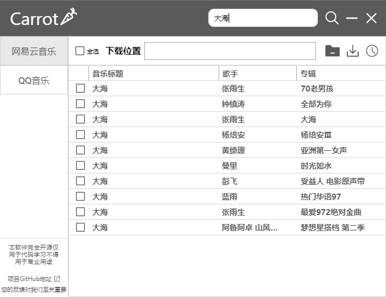
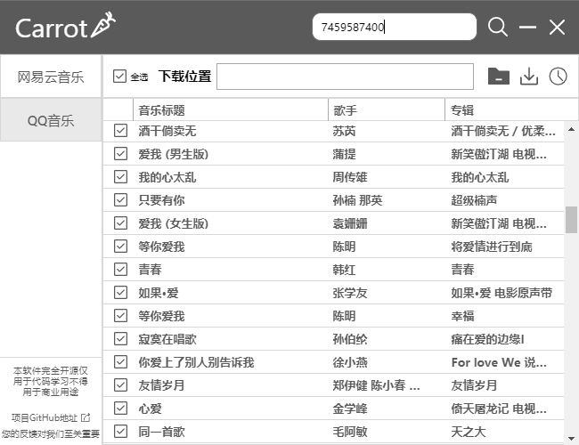
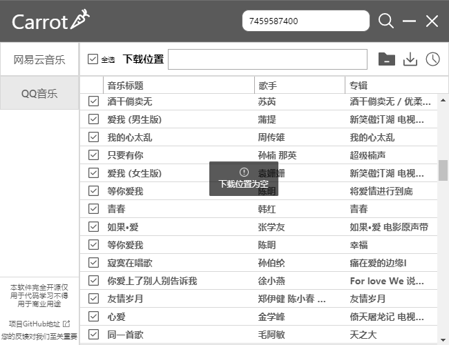

# Carrot Music Downloader
一款基于Electron + Python的跨平台、图形化的歌曲、歌单下载器，支持多种音乐平台免费下载

本软件完全开源，仅用于代码学习，不得用于商业用途。

## 支持的功能

1. 通过歌名搜索
2. 通过歌手搜索
3. 获取歌单
4. 支持可试听的音乐下载，包括需要VIP才能下载的音乐，但不支持下载只能试听的音乐

## 完成度

目前对接了`网易云音乐`以及`QQ音乐`，由于出色的扩展性，今后会不定期更新，同时非常欢迎开源共建以及在Issues中提交您的宝贵建议。

## 下载
请到项目[release](https://github.com/Carrot-Software/carrot-music-downloader/releases)页面进行对应版本下载

或者使用网盘下载：[https://tc5.us/file/21158285-437735009](https://tc5.us/file/21158285-437735009)

## 跨平台与扩展新

由于项目采用Electron + Python，所以支持跨平台，若release中没有您需要的平台，您可以手动打包。

前端与服务端详细介绍分别位于：desktop与server目录的README.md中

## 应用截图

